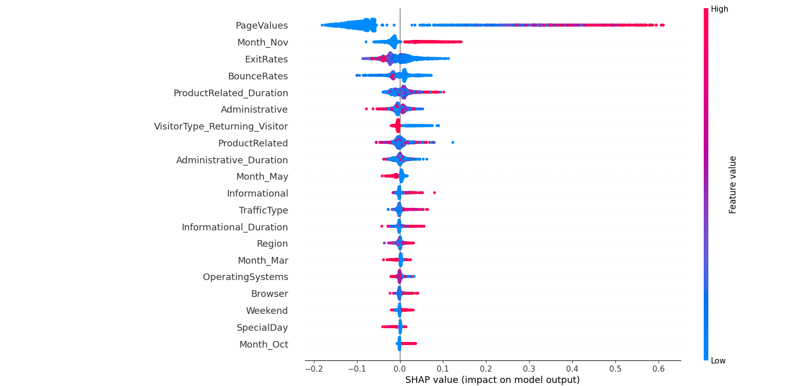
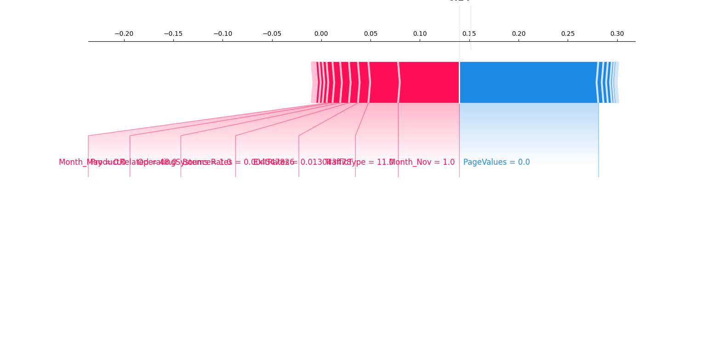
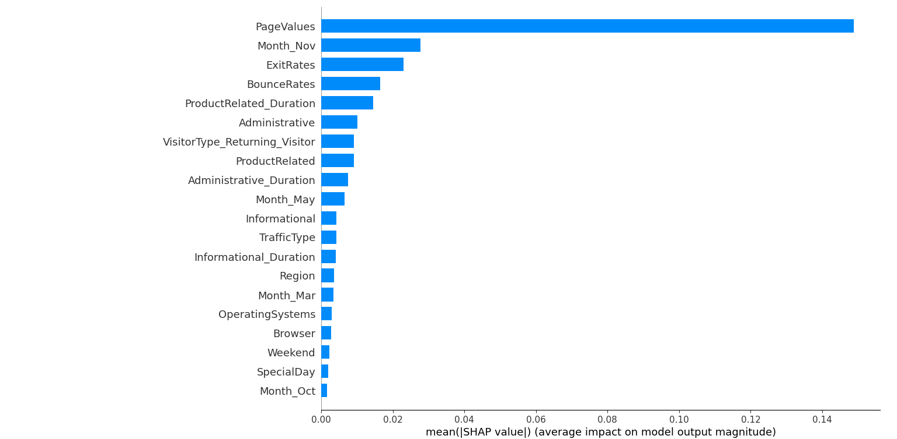
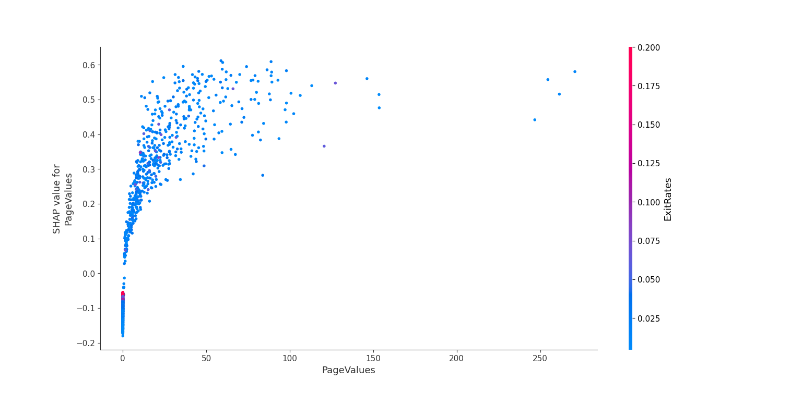

# 🧠 Intelligent Explainable AI Marketing Dashboard


---

## 🚀 Live Demo

👉 Hugging Face Space:  
https://huggingface.co/spaces/your-username/xai-marketing-dashboard

👉 Streamlit Cloud:  [
https://marketingxai.streamlit.app](https://marketingxai-xq8utybfup9f7ruuerjwxv.streamlit.app/)

---

## 📌 Overview

An **Explainable AI-powered Marketing Dashboard** that helps businesses make **data-driven decisions** using:

- Machine Learning
- Explainable AI (SHAP + LIME)
- Interactive Visualizations

---

## ✨ Features

### 📊 Executive Dashboard
- User & conversion tracking
- Conversion rate insights
- Customer funnel visualization

### 📈 Advanced Analytics
- Scatter, violin, histogram analysis
- Correlation heatmap
- Time-series sales forecasting (ARIMA)

### 🧠 Explainable AI (XAI)
- SHAP Feature Importance
- SHAP Waterfall Explanation
- LIME Local Interpretability

### 🎯 Marketing Decision Engine
- Predict purchase probability
- Smart segmentation:
  - 🟢 High Value Customers
  - 🔵 Potential Customers
  - 🔴 At Risk Users

### 📊 KPI Dashboard
- AOV (Average Order Value)
- CAC (Customer Acquisition Cost)
- ROI (Return on Investment)

---

## 🖼️ Screenshots

### 📊 Dashboard Overview


### 📈 Analytics View


### 🧠 SHAP Explainability


### 📊 KPI Dashboard


---

## 📂 Project Structure
├── xai.py # Main Streamlit app
├── model.pkl # Trained ML model
├── online_shoppers_intention.csv # Dataset
├── requirements.txt # Dependencies
├── LICENSE # MIT License
│
├── Figure_1.png # Dashboard image
├── Figure_3.png # Analytics image
├── Figure_4.png # KPI image
├── Sheap_value.png # SHAP visualization

---
### Dataset
*** Source: Kaggle (Online Shoppers Intention Dataset)
* Includes:
- PageValues
- BounceRates
- ExitRates
- Session Duration
- Purchase Behavior
Dataset link:-
[Click here]("https://www.kaggle.com/datasets/imakash3011/online-shoppers-purchasing-intention-dataset?select=online_shoppers_intention.csv")
---

## ⚙️ Installation

### 1️⃣ Clone Repository
```bash
git clone https://github.com/your-username/This-is-Yash.git
cd This-is-Yash
pip install -r requirements.txt
streamlit run xai.py
```
---
### Tech Stack
- Frontend: Streamlit
- Backend: Python
- ML Model: Random Forest Classifier
- Explainability: SHAP, LIME
- Visualization: Plotly, Matplotlib
- Forecasting: ARIMA

---


### How It Works
- Data is uploaded or loaded
- Preprocessing & encoding applied
- Model predicts purchase probability
- SHAP & LIME explain predictions
- Dashboard visualizes insights
- Marketing recommendations are generated

---

### License

- This project is licensed under the MIT License.

---
### Contributing

*** Contributions are welcome!

- Fork the repo
- Create a new branch
- Submit a Pull Request

---

### ⭐ Support

*** If you like this project:

- ⭐ Star this repository
- 🍴 Fork it
- 📢 Share with others

---
